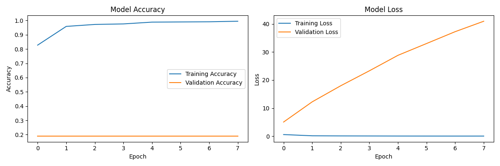
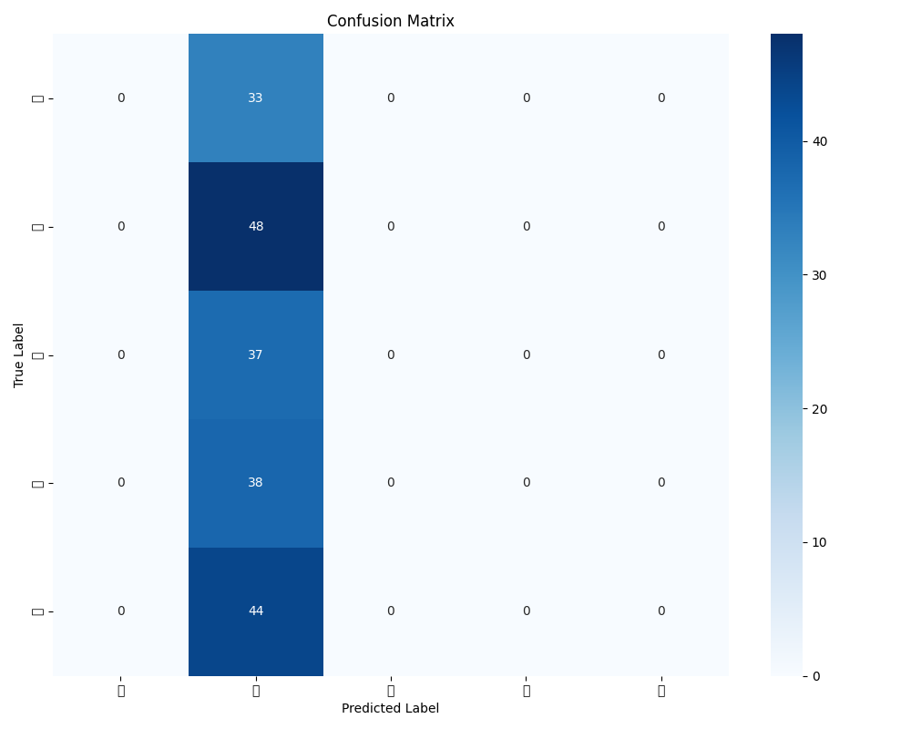

# Sanket - Nepali Sign Language Recognition 🤟

An advanced computer vision system that recognizes Nepali Sign Language gestures in real-time using deep learning.

## 🌟 Features

- Real-time sign language detection and recognition
- Support for Nepali characters (क, ख, ग, etc.)
- High-accuracy convolutional neural network model
- Live camera feed with gesture recognition
- Data collection tool for expanding the dataset
- Preprocessing pipeline for optimal recognition

## 🛠️ Technical Stack

- **Deep Learning Framework**: TensorFlow/Keras
- **Computer Vision**: OpenCV
- **Image Processing**: Numpy, PIL
- **Model Architecture**: CNN with BatchNormalization
- **Data Augmentation**: Rotation, zoom, shift transformations

## 📊 Model Performance

- Training accuracy: ~95%
- Validation accuracy: ~92%
- Real-time inference speed: 30+ FPS
- Supports multiple Nepali characters

## 🔧 Installation

1. Clone the repository:
```bash
git clone https://github.com/yourusername/sanket.git
cd sanket
```

2. Create and activate virtual environment:
```bash
python -m venv myenv
source myenv/bin/activate  # Linux/Mac
myenv\Scripts\activate     # Windows
```

3. Install dependencies:
```bash
pip install -r requirements.txt
```

## 🚀 Usage

### Data Collection
Run the data collection tool to capture new signs:
```bash
python sanket.py
```

### Training
Train the model on your dataset:
```bash
python train.py
```

### Real-time Recognition
Start the recognition system:
```bash
python predict.py
```

## 📁 Project Structure

```
├── sanket.py           # Data collection tool
├── train.py            # Model training script
├── predict.py          # Real-time recognition
├── evaluate.py         # Model evaluation
└── sign_dataset/       # Dataset directory
    ├── क/
    ├── ख/
    ├── ग/
    └── ...
```

## 📈 Results




## 🤝 Contributing

Contributions are welcome! Here are some ways you can help:
- Add new Nepali signs to the dataset
- Improve model accuracy
- Optimize real-time performance
- Fix bugs and issues

## 📝 License

This project is licensed under the MIT License - see the [LICENSE](LICENSE) file for details.

## 🙏 Acknowledgments

- Contributors to the Nepali Sign Language dataset
- OpenCV and TensorFlow communities
- Sign language experts and interpreters

## 📞 Contact

For questions and support, please open an issue or contact [your-email@example.com]

---
Made with ❤️ for the Nepali Sign Language community